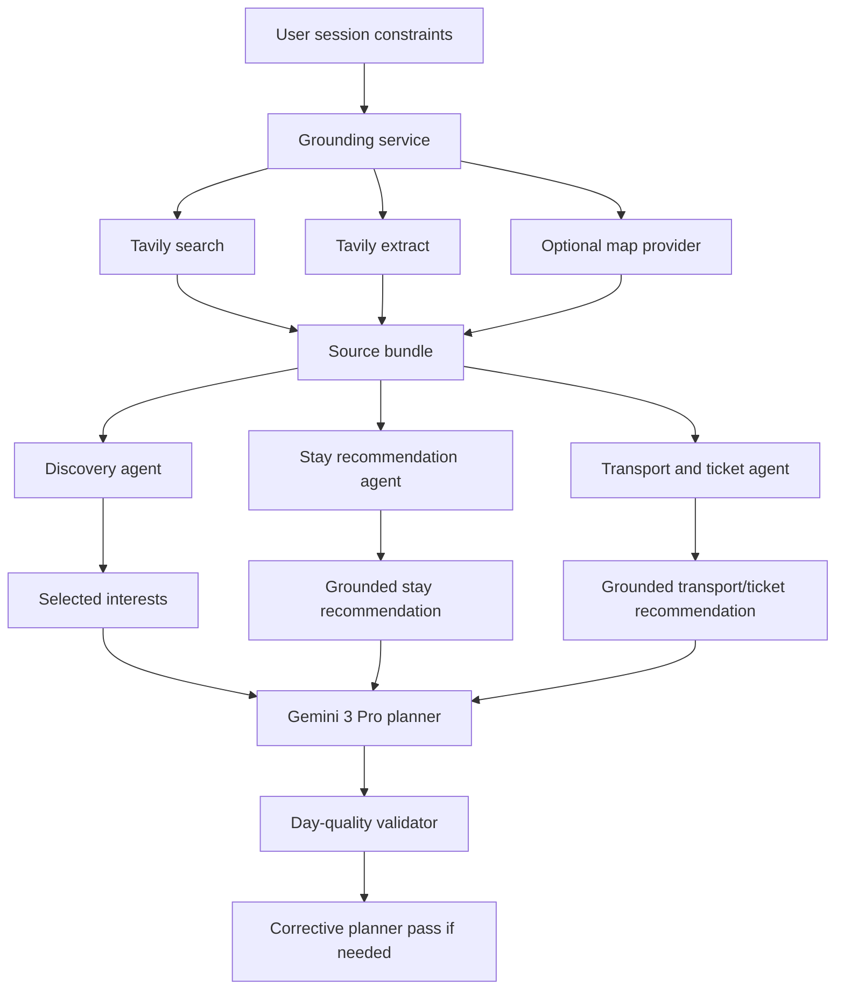

# Grounded Travel Intelligence Design

## Purpose

Plan20 upgrades the MVP from a fixture-safe travel planner into a more credible real planning assistant. The product should no longer feel like it only invents a plausible itinerary from generic destination knowledge. It should read real travel guides and source pages, recommend real hotels and booking/search links, expose price ranges with confidence, and judge whether each day feels like a full but realistic travel day.

The first Plan20 release is still not a booking engine. It will not sell hotels, train tickets, flights, or attraction tickets in-app. It will provide grounded recommendations, source links, price ranges, and clear caveats so a user can continue to the official site or a booking platform.

## User Outcome

A user should be able to run a real demo and see:

1. Discovery cards based on a small set of read source pages, not only search snippets.
2. Images that render from real source image URLs or degrade gracefully.
3. Hotel suggestions with real hotel names, areas, source links, and price bands.
4. Transport and ticket suggestions with real query-backed options, price bands, and purchase/search links.
5. A final itinerary that understands day shape: morning/afternoon/evening rhythm, meal timing, transit friction, walking load, opening-hour risk, and whether the day is too empty or too packed.
6. Stronger model quality for reasoning-heavy steps through Gemini 3.

## Non-Goals

- No in-app booking, payment, inventory lock, ticket issuance, or cancellation handling.
- No guarantee that prices or availability are live at the moment the user clicks.
- No hard dependency on AMap. Mapbox and search-backed grounding must remain useful if AMap is unavailable.
- No full supplier marketplace integration in this plan.
- No user accounts or saved payment data.

## Model Strategy

Plan20 introduces model roles instead of treating every LLM call as equal.

- Research compression: `gemini-3-flash-preview` by default, because this step summarizes several source pages and benefits from lower cost and lower latency.
- Discovery generation: `gemini-3-flash-preview` or `gemini-3-pro-preview`, configurable. The default can stay Flash if output quality is acceptable.
- Stay, transport, and ticket recommendation synthesis: `gemini-3-flash-preview` for first pass.
- Final itinerary planning: `gemini-3-pro-preview`.
- Day-quality review and corrective pass: `gemini-3-pro-preview`.

The API keeps a single fallback model setting, but adds optional role-specific settings. If Gemini 3 preview is unavailable for the user's key, the app should fail clearly in real smoke mode and keep fixture regression deterministic.

## Architecture

Add a small grounded recommendation layer between providers and graph nodes.

The existing graph remains recognizable: discovery, stay, transport, planner, validator. Plan20 changes the quality of their inputs and outputs, not the route structure.

## Grounding Service

Create a reusable grounding service that can:

- Build intent-specific search queries for destination guides, hotels, intercity transport, local transport, and attraction tickets.
- Run Tavily search with richer settings, including images and raw content when available.
- Extract the top source URLs to obtain readable page content and source images.
- Normalize pages into compact source bundles with title, URL, snippet, extracted text, image URLs, query category, and freshness metadata.
- Deduplicate sources by canonical URL and remove low-value pages where title/content is empty.

The service should return enough source material for the LLM to cite and reason, while keeping prompts short. Long extracted pages are compressed into source summaries before being passed to later agents.

## Data Model Changes

Add source-aware recommendation entities while preserving backward compatibility as much as possible.

New or extended concepts:

- `GroundedSource`: provider, title, URL, query category, excerpt, image URLs, retrieved timestamp.
- `RecommendationLink`: label, URL, provider, purpose such as guide, hotel_search, transport_search, ticket_purchase, official_site.
- `PriceObservation`: item name, price band, basis, confidence, source URL, note.
- Discovery cards gain source references and primary image provenance.
- `SampleHotel` gains source links, booking/search links, price confidence, and optional rating/location text when available.
- Transport legs gain external links and evidence notes.
- Attraction/ticket suggestions can be attached to discovery cards or itinerary segments as source-backed purchase/search guidance.
- Validator issues gain optional `day_quality` codes for daily rhythm and feasibility problems.

Any TypeScript generated types must be regenerated after schema changes.

## Discovery Flow

Discovery should read several real guides before generating cards.

The first version should gather at least:

- 2-3 destination guide pages.
- 1 food/local experience page.
- 1 transportation or practical planning page.

The prompt should ask the model to:

- Prefer facts that appear in the grounded sources.
- Include source references for each card where possible.
- Avoid inventing image URLs.
- Produce cost estimates as ranges when the source supports it, otherwise mark confidence low.
- Separate attraction/experience discovery from final hotel and route choices.

Cards without a direct image should still render with a polished placeholder. Broken images should fall back client-side without collapsing the card.

## Stay Recommendations

The stay node should move from generic area-only advice to grounded hotel candidates.

The first release should search for hotels using destination, area names, trip style, and budget. It should return:

- Primary area recommendation.
- 2-4 real hotel candidates for the primary option.
- 1-3 real hotel candidates across alternatives.
- Price band per room per night or per trip, clearly marked.
- Links to hotel source pages, booking search pages, or map/search result pages.
- Fit reason based on selected attractions, transit convenience, quiet/lively preference, and budget.

If hotel grounding fails, the node should still return area advice, but with empty or low-confidence hotel candidates and a visible source note.

## Transport And Tickets

The transport node should use real web grounding for intercity travel and ticket guidance.

For rail/flight/flexible preferences, it should return:

- Arrival and departure mode recommendation.
- Search-backed duration and price range.
- External search or official purchase links when available.
- Tradeoffs such as time saved, transfer friction, luggage burden, and airport/station distance.

For attraction tickets, Plan20 does not need a new standalone route. It can attach ticket guidance to discovery cards and final itinerary segments:

- Whether ticket booking is recommended.
- Approximate ticket price band.
- Official site or reputable platform link.
- Booking timing note, such as advance reservation or same-day purchase.

## Day-Quality Planning

The planner should reason about what makes a good travel day, not only place order.

Each day should be evaluated for:

- Start and end rhythm: not every day should begin too early or end too late.
- Activity density: enough meaningful blocks without overloading.
- Transit friction: avoid zigzagging across the city.
- Meal rhythm: lunch and dinner should be placed near plausible areas.
- Recovery time: include buffers after long transit, intense walking, late nights, or arrival/departure.
- Opening-hour and reservation risk: flag if a source suggests booking or timing constraints.
- Budget realism: day-level costs should roll up into the trip budget.

The validator should add warning codes for days that are too empty, too packed, too fragmented, missing meals, or dependent on risky unverified timing. The corrective planner pass should fix these issues before returning the final itinerary when possible.

## Frontend Changes

Discovery cards should:

- Show real images when available.
- Fall back gracefully when images fail.
- Surface source links compactly.
- Show price ranges instead of only `free/low/medium/high` when available.

Stay and itinerary views should:

- Show real hotel candidates and links.
- Show transport/ticket links as external actions.
- Label estimate confidence so users understand what is grounded and what is approximate.

The UI should avoid sounding like it has sold or reserved anything.

## Error Handling

Provider and LLM failures should degrade by layer:

- If extraction fails but search succeeds, use search snippets and mark lower confidence.
- If image extraction fails, render image fallback.
- If hotel grounding fails, return area-only stay advice.
- If transport/ticket grounding fails, return estimated ranges with clear source notes.
- If Gemini 3 preview is unavailable, real smoke should fail clearly; fixture mode remains green.
- If extracted content is too long, summarize before final planning.

No secret values should appear in logs, source notes, UI, or smoke output.

## Testing Strategy

Offline regression remains deterministic:

- Unit tests for Tavily search/extract normalization.
- Unit tests for source dedupe, content truncation, image filtering, and fallback paths.
- Schema tests for new grounded recommendation fields.
- Graph tests with fixture source bundles.
- Frontend tests for image fallback, source links, price bands, and hotel rendering.
- Validator tests for day-quality issues.

Real smoke is explicit opt-in:

- Run with real Tavily and Gemini keys.
- Verify discovery uses extracted source content.
- Verify at least one real image URL reaches the frontend payload.
- Verify hotel candidates include external links.
- Verify transport/ticket recommendations include price ranges or source-backed caveats.
- Verify final itinerary passes day-quality validation or returns clear warnings.

## Acceptance Criteria

Plan20 is complete when:

1. A real demo can produce source-backed discovery cards for a destination.
2. Discovery images either render or fall back cleanly.
3. Stay recommendations include real hotel candidates with source links when grounding succeeds.
4. Transport and ticket guidance includes real external links and price bands when grounding succeeds.
5. The final itinerary is reviewed for day quality and corrected when obviously too empty, too packed, or poorly paced.
6. High-reasoning steps use `gemini-3-pro-preview` through configuration.
7. Fixture regression remains green and does not require live API keys.
8. Real smoke output proves the agent read source content instead of relying only on generic knowledge.

## References

- Gemini 3 Developer Guide: https://ai.google.dev/gemini-api/docs/gemini-3
- Gemini model list: https://ai.google.dev/models/gemini
- Tavily Search API: https://docs.tavily.com/documentation/api-reference/endpoint/search
- Tavily Extract API: https://docs.tavily.com/documentation/api-reference/endpoint/extract

## Implementation Sequence

The implementation plan should split Plan20 into independently reviewable tasks:

1. Add model-role configuration and Gemini 3 support.
2. Add Tavily extract/image grounding primitives.
3. Extend schemas and generated TypeScript types for grounded sources and links.
4. Upgrade discovery to use source bundles and image provenance.
5. Upgrade stay recommendations with real hotel candidates.
6. Upgrade transport and ticket guidance with source-backed links and price bands.
7. Add day-quality validation and corrective planner behavior.
8. Update frontend rendering for sources, links, price bands, images, and hotels.
9. Add offline fixture tests and real smoke gate.
